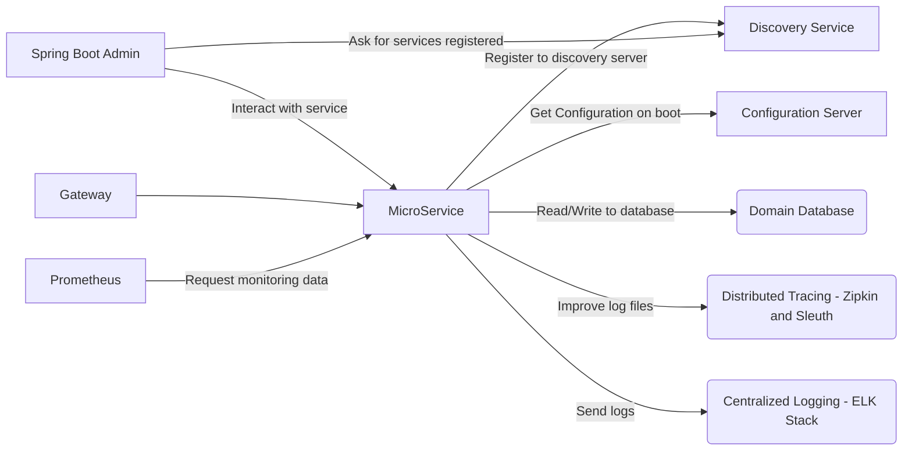
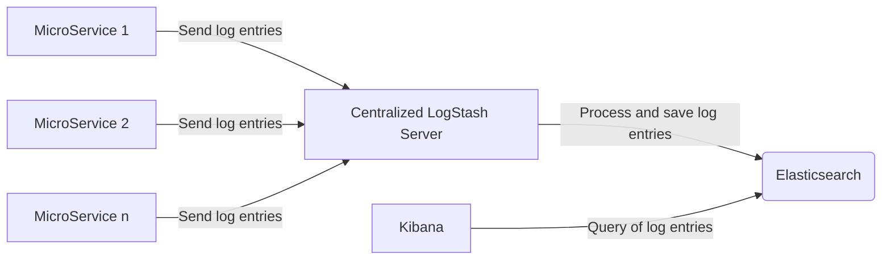

# GOAIGUA MICROSERVICE TEMPLATE

This proyect is a template for new microservices within the GoAigua platform.  
It is a functioning Spring Boot service, it contains the basic structure of a microservice, with an example of enpoint.  
It is based on version 2.2.6.RELEASE of Spring Boot and 8 of Java.


## Way of working for the development of the microservice

The microservice has been prepared so that when it starts it connects to a configuration server and downloads the configuration it needs.  
As the above is not comfortable for programmer work, the microservice is prepared so that when a developer works with it, the maven profile is configured as `local`, this way you do not need a configuration server or other additional service of the platform.


### Coding Conventions / Processes

- Use the `CHANGELOG.md` file, which uses the [Keep a Changelog](https://keepachangelog.com/en/1.0.0/) standard to track changes in the code.
- Use [Semantic Versioning 2.0.0](https://semver.org/spec/v2.0.0.html) to choose a new version of the microservice.
- Use [git flow](https://www.atlassian.com/git/tutorials/comparing-workflows/gitflow-workflow)
    - `feature/*` branches MUST be reviewed by another developer before merge
    - `feature/*` branches MUST add a new entry in the `Unreleased` section of the `CHANGELOG.md` before merge
    - `release/*` and `hotfix/*` branches MUST update the `version` in the `pom.xml`and create a new section for the version in the `CHANGELOG.md`


## Ecosystem for which the template is prepared:



### General microservice configuration:

The specific variables of the microservice are the following:

```ini
PORT_NUMBER=9002
PROFILE=devd
```

### Configuration server

This service is responsible for returning the microservice configuration, based on its name and the destination environment (PROFILE). It is based on the [Spring Cloud Config](https://cloud.spring.io/spring-cloud-config/reference/html/).  
To configure it, the following environment variables must be modified:

```ini
PROFILE=devd
CONFIG_URI=http://192.168.3.48:8888
```

This service is not deactivatable, outside the development environment.


### Discovery service

This service is responsible for maintaining the inventory of microservices and the number of replicas of each. It is based on [Spring Cloud Netflix Eureka](https://spring.io/projects/spring-cloud-netflix).  
To configure it, the following environment variable must be modified:

``` ini
DISCOVER_URI=http://192.168.3.48:8761/eureka
```

This service is not deactivatable, outside the development environment.


### Spring Boot Admin

This service is a UI to manage spring boot services. It connects to the Discovery service to see the services that are within the platform. It is based on [Spring Boot Admin] (https://github.com/codecentric/spring-boot-admin).  
In order for it to manage the services, it is advisable to modify the following variables:

``` ini
management.endpoints.web.exposure.include=*
management.endpoint.health.show-details=always
```


### Centralized logging

In order for the service to have centralized logging, the `logback.xml` file has to be modified so that messages can be sent to a centralized LogStash service.



To be able to do this, you have to modify the appender that was in the file and leave it as follows:

```xml
<appender name="LOGSTASH"
			class="net.logstash.logback.appender.LogstashTcpSocketAppender">
			<destination>${LOGSTASH_URL}</destination> 
			<encoder
				class="net.logstash.logback.encoder.LoggingEventCompositeJsonEncoder">
				<providers>
					<mdc />
					<context />
					<version />
					<logLevel />
					<loggerName />
					<message />
					<pattern>
						<pattern>
							{
								"appName": "@project.artifactId@",
								"serviceName": "@project.artifactId@",
								"profileName": "${PROFILE}",
								"type": "logback"
							}
						</pattern>
					</pattern>
					<threadName />
					<stackTrace />
				</providers>
			</encoder>
		</appender>
		<root>
			<appender-ref ref="LOGSTASH" />
		</root>
```

To configure it, the following environment variables must be modified:

```ini
PROFILE=devd
LOGSTASH_URL=192.168.3.131:4560
```


### Distributed Tracing

To get the microservices to have Distributed Tracing, use the tandem [Zipkin](https://zipkin.io/) - [Spring Cloud Sleuth](https://spring.io/projects/spring-cloud-sleuth).  
To configure it, the following environment variable must be modified:

``` ini
PROFILE=devd
ZIPKIN_URI=http://192.168.3.48:9411

SPRING_ZIPKIN_ENABLED=true
SPRING_SLEUTH_ENABLED=true
SPRING_SLEUTH_INTEGRATION_ENABLED=true

SPRING_ZIPKIN_SERVICE_NAME=${PROFILE}-${spring.application.name}
```

To have only one Zipkin server for all installations and not have one per installation, the following parameter has been changed to differentiate the different environments:

``` ini
SPRING_ZIPKIN_SERVICE_NAME=${PROFILE}-${spring.application.name}
```

Additionally, the following system variables can be added so that information from external service logs is not generated:

```ini
LOGGING_LEVEL_COM_NETFLIX_EUREKA=OFF
LOGGING_LEVEL_COM_NETFLIX_DISCOVERY=OFF
LOGGING_LEVEL_COM_NETFLIX_LOADBALANCER=OFF
LOGGING_LEVEL_ORG_APACHE_HTTP=OFF
```

To deactivate Distributed Tracing, the following environment variables must be changed:

```ini
SPRING_ZIPKIN_ENABLED=false
SPRING_SLEUTH_ENABLED=false
SPRING_SLEUTH_INTEGRATION_ENABLED=false
```


## Configuration files to start the service from docker

To start the docker service and facilitate its con fi guration it is recommended to use [Docker-Compose](https://docs.docker.com/compose/) and create the following 2 files:
* **docker-compose.yml:** File responsible for microservice startup configuration.
* **env_file.env:** File with system variables that are shared by the rest of the microservices that form the core of the platform.

The content of the files would be as follows:

### docker-compose.yml

``` yaml
version: '3.7'
services:
    goaigua-microservice-template:
        image: nexus-dockergroup.dev.idrica.pro/goaigua-microservice-template:0.1.0-SNAPSHOT
        container_name: goaigua-microservice-template
        environment:
            - PORT_NUMBER=9002
        env_file:
            - env_file.env
networks:
  default:
    external:
      name: lite_default
```

### env_file.env

```ini
PROFILE=pre
CONFIG_URI=http://192.168.3.48:8888
DISCOVER_URI=http://192.168.3.48:8761/eureka
SPRING_BOOT_ADMIN_URL=http://192.168.3.48:2222
LOGSTASH_URL=192.168.3.131:4560
ZIPKIN_URI=http://192.168.3.48:9411

SPRING_ZIPKIN_ENABLED=true
SPRING_SLEUTH_ENABLED=true
SPRING_SLEUTH_INTEGRATION_ENABLED=true

SPRING_ZIPKIN_SERVICE_NAME=${PROFILE}-${spring.application.name}

LOGGING_LEVEL_COM_NETFLIX_EUREKA=OFF
LOGGING_LEVEL_COM_NETFLIX_DISCOVERY=OFF
LOGGING_LEVEL_COM_NETFLIX_LOADBALANCER=OFF
LOGGING_LEVEL_ORG_APACHE_HTTP=OFF
```

